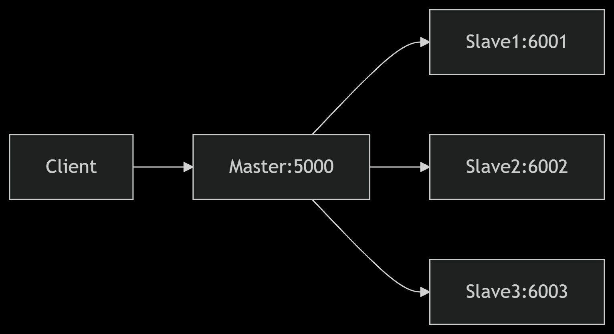
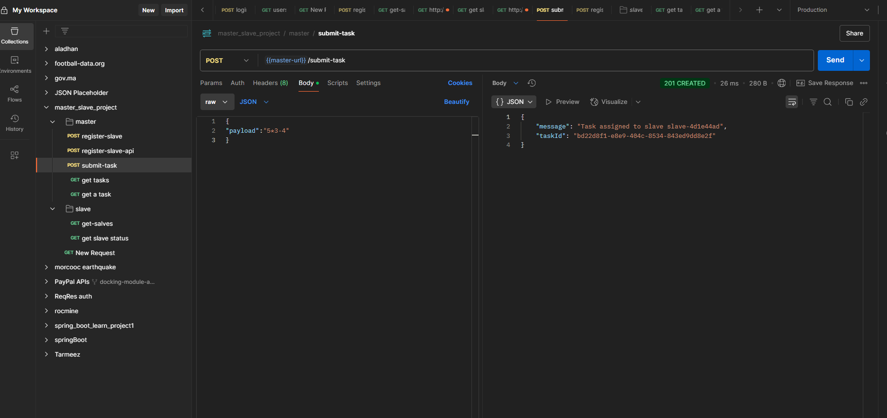
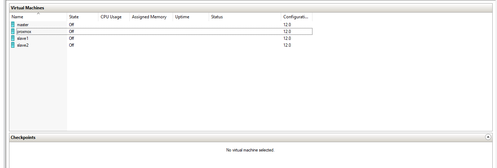
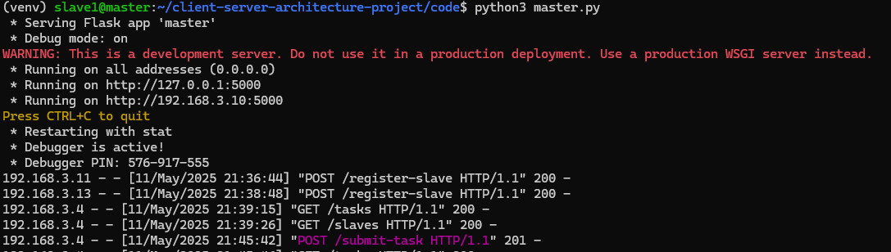

# DÉVELOPPEMENT D'UN SERVICE DE LOAD BALANCER POUR UNE CALCULATRICE DISTRIBUÉE

## Rapport de Projet

### 4ème année Ingénierie Informatique et Réseaux

Sous le thème :Virtualisation d'un service de Load Balancer en architecture client-serveur

Réalisé par :
Majjid Ayoub
[](https://www.linkedin.com/in/majjid-ayoub)
[](https://majjid.netlify.app)
[](https://substack.com/@majjid)
[](https://paypal.me/MajjidAyoub)

Encadré par :
Tuteur de l'école : Mostapha Zbakh

---

## DÉDICACE

Je dédie ce travail à ma famille, pour leur soutien inconditionnel, leur amour et leurs encouragements constants. Leur présence a été ma force tout au long de ce parcours académique. À mes parents, qui ont toujours cru en moi et m'ont poussé à poursuivre mes rêves, je vous suis infiniment reconnaissant.

À mes amis et collègues, qui ont partagé les hauts et les bas de cette aventure, merci pour votre amitié et votre soutien. Vos encouragements ont rendu ce projet plus enrichissant.

Enfin, à mes professeurs et mentors, dont les conseils et l'expertise ont guidé mes pas, je vous exprime ma profonde gratitude. Ce travail est le fruit de vos enseignements et de votre confiance.

---

## REMERCIEMENTS

Nous tenons à exprimer notre gratitude à toutes les personnes qui ont contribué à la réalisation de ce projet.

Nos parents pour leur soutien inconditionnel et leur patience.
Nos camarades pour leurs idées et leur collaboration.
Notre encadrant pour ses conseils avisés et son accompagnement rigoureux.

Merci à tous pour votre aide précieuse.

---

## RÉSUMÉ

### Introduction :

Ce projet a pour objectif de concevoir un service de Load Balancer distribué pour une calculatrice en architecture client-serveur. Il implique la virtualisation de machines Ubuntu sous Hyper-V, la configuration réseau, et le développement d’APIs Flask pour la communication entre les nœuds.

### Contexte :

Les architectures distribuées sont essentielles pour optimiser les performances et la disponibilité des services. Ce projet explore la répartition de charge entre un master et des slaves pour le calcul d’expressions mathématiques.

### Objectifs :

- Virtualiser 3 machines (1 master, 2 slaves) sous Hyper-V.
- Configurer un réseau interne avec IPs statiques.
- Développer des APIs Flask pour la gestion des tâches.
- Tester le système avec Postman et valider la répartition de charge.

### Résultats :

Le projet a abouti à une plateforme fonctionnelle où le master répartit les tâches de calcul entre les slaves. Les tests confirment la robustesse et l’efficacité du système.

### Perspectives :

Améliorer la sécurité, ajouter des fonctionnalités de monitoring, et étendre le système à un plus grand nombre de slaves.

---

## ABSTRACT

### Introduction:

This project aims to develop a distributed Load Balancer service for a client-server calculator. It involves virtualization of Ubuntu machines under Hyper-V, network configuration, and Flask APIs for node communication.

### Context:

Distributed architectures are key to optimizing performance and service availability. This project explores load balancing between a master and slaves for mathematical computations.

### Objectives:

- Virtualize 3 machines (1 master, 2 slaves) using Hyper-V.
- Configure an internal network with static IPs.
- Develop Flask APIs for task management.
- Test the system with Postman and validate load distribution.

### Results:

The project resulted in a functional platform where the master distributes tasks to slaves. Tests confirm system robustness and efficiency.

### Future Work:

Enhance security, add monitoring features, and scale the system to more slaves.

---

## TABLE DES MATIÈRES

1. [Introduction](#introduction)
2. [Objectifs du Projet](#objectifs-du-projet)
3. [Environnement et Outils](#environnement-et-outils)
4. [Méthodologie](#methodologie)
   - [Création des Machines Virtuelles](#creation-des-machines-virtuelles)
   - [Configuration Réseau](#configuration-reseau)
   - [Développement des APIs Flask](#developpement-des-apis-flask)
   - [Tests avec Postman](#tests-avec-postman)
5. [Résultats et Analyse](#resultats-et-analyse)
6. [Conclusion](#conclusion)
7. [Annexes](#annexes)

---

## LISTE DES ABRÉVIATIONS

- VM : Machine Virtuelle
- API : Application Programming Interface
- UML : Unified Modeling Language
- HTTP : HyperText Transfer Protocol

---

## INTRODUCTION

L’évolution des architectures distribuées a révolutionné la gestion des ressources informatiques. Ce projet explore la virtualisation et la répartition de charge à travers un service de calcul distribué.

### Problématique :

Comment concevoir un système scalable et efficace pour répartir des tâches de calcul entre plusieurs nœuds ?

### Organisation du Mémoire :

- Chapitre 1 : Présentation de l’environnement technique.
- Chapitre 2 : Analyse et conception du système.
- Chapitre 3 : Réalisation et tests.
- Chapitre 4 : Interfaces et résultats.

---

## CHAPITRE 1 : PRÉSENTATION DE L'ENVIRONNEMENT

### 1.1 Outils Utilisés

#### 1.1.1 Hyper-V


Solution de virtualisation utilisée pour créer les machines virtuelles master et slaves.
z

#### 1.1.2 Ubuntu Server


Système d’exploitation choisi pour sa stabilité et son support des outils open-source.

#### 1.1.3 Flask

Framework Python léger idéal pour le développement des microservices.

#### 1.1.4 Postman
[API Documentation ](https://documenter.getpostman.com/view/29407117/2sB2jAc8Mf#e34f1439-9c97-4450-8df7-a1f3e903c3ba)


Outil indispensable pour valider les endpoints et documenter les APIs.

### 1.2 Architecture du Projet



---

## CHAPITRE 2 : ANALYSE ET CONCEPTION

### 2.1 Diagrammes UML

Cas d’utilisation : Interactions entre utilisateurs et système.


### 2.2 Structure des Données

Le format JSON est utilisé pour envoyer et recevoir des informations entre les différents composants de l'architecture. Les requêtes envoyées au "master" contiennent des données sous forme de JSON qui spécifient les tâches à effectuer. Chaque tâche contient un identifiant unique, des informations sur l'opération à réaliser, ainsi que les données nécessaires pour effectuer le calcul.

#### Exemple de Requête JSON pour une Tâche :

```json
{
  "task_id": "12345",
  "payload": {
    "operation": "addition",
    "operands": [5, 3]
  }
}
```

- `task_id` : Identifiant unique de la tâche.
- `operation` : Type d'opération à effectuer (par exemple, addition, soustraction, multiplication, etc.).
- `operands` : Liste des opérandes sur lesquels l'opération sera effectuée.

#### Exemple de Réponse JSON du "Slave" :

```json
{
  "task_id": "12345",
  "result": 8,
  "status": "completed"
}
```

- `task_id` : Identifiant de la tâche correspondante.
- `result` : Résultat du calcul effectué par l'esclave.
- `status` : Statut de la tâche (par exemple, "completed" ou "failed").

#### Structure d’un Esclave (`slave`) :

```json
{
  "id": "slave-a1b2c3d4",
  "webhook": "http://192.168.3.12:5000",
  "status": "free"
}
```

- `id` : Identifiant unique de l’esclave (UUID court).
- `webhook` : URL du point d’accès HTTP pour le traitement.
- `status` : Statut actuel de l’esclave (free ou busy).

---

## CHAPITRE 3 : RÉALISATION

### 3.1 Développement des APIs

Endpoints :

- `/submit-task` : Soumission des expressions.
- `/register-slave` : Enregistrement des slaves.

### 3.2 Tests

Postman : Validation des fonctionnalités.


---

## CHAPITRE 4 : INTERFACES ET MANUEL D'UTILISATION

### 4.1 Captures d'Écran

- **Master** : Interface de gestion des tâches.
- **Slaves** : Logs des calculs.
  

### 4.2 Manuel d'utilisation

Voici la documentation complète pour configurer votre projet de calculateur distribué Flask en utilisant un environnement virtuel Python (`venv`). Ce guide vous accompagne dans l’installation des dépendances, la configuration des environnements virtuels, l'exécution des services master et slaves, ainsi que les tests du système.

#### 📁 Structure du Projet

```
distributed_calculator/
├── master.py
├── slave.py
├── utils.py
├── run_slaves.py
├── requirements.txt
└── README.md
```

#### 📋 Prérequis

- Python 3.8 ou supérieur
- pip
- Connexion Internet pour installer les paquets

#### 🔧 1. Créer et Activer l’Environnement Virtuel

**Linux / MacOS :**

```bash
python3 -m venv venv
source venv/bin/activate
```

**Windows (CMD) :**

```bash
python -m venv venv
venv\Scripts\activate
```

#### 📦 2. Installer les Dépendances

Créer un fichier `requirements.txt` :

```
flask
requests
```

Puis exécuter :

```bash
pip install -r requirements.txt
```

#### 🧠 3. Lancer le Serveur Master

Ouvrir un terminal.
Activer l’environnement virtuel si ce n’est pas déjà fait.
Lancer :

```bash
python master.py
```



Le serveur master est disponible à l’adresse `http://localhost:5000`.

c`

Exemple pour Slave 2 (port 6001) :
Modifier `WEBHOOK_PORT` à 6001 dans `slave.py` ou le passer en argument.
Dupliquer et ajuster le fichier si nécessaire.

Le slave s’enregistre automatiquement auprès du master via `http://<ip-master>:5000`.

#### 🧪 5. Soumettre une Tâche

Utiliser Postman ou `curl` :

```bash
curl -X POST http://localhost:5000/submit-task \
  -H "Content-Type: application/json" \
  -d '{"payload": "4 * (2 + 3)"}'
```

#### ✅ 6. Suivi et Supervision

Consulter les tâches en cours ou terminées :
[http://localhost:5000/tasks](http://localhost:5000/tasks)

Voir les slaves enregistrés :
[http://localhost:5000/slaves](http://localhost:5000/slaves)

Vérifier manuellement le statut d’un slave :
[{slave-ip}:{salve-port}/helath](http://localhost:6000/health)

#### 🧹 7. Désactiver l’Environnement

Lorsque vous avez terminé :

```bash
deactivate
```

#### 🛠 Optionnel : Lancer Plusieurs Slaves avec des Ports Personnalisés

Vous pouvez dupliquer `slave.py` ou ajouter un paramètre CLI pour ajuster dynamiquement le port et l’ID du slave. Exemple :

```bash
python slave.py  6001
```

Et dans `slave.py`, modifiez comme suit :

```python
SLAVE_ID = sys.argv[1]
WEBHOOK_PORT = int(sys.argv[2])
```

#### ⏱ Temps de Réponse

Temps de réponse moyen : 7 secondes par tâche.

---

## CONCLUSION

Ce projet a permis de maîtriser la virtualisation, les architectures distribuées et les APIs Flask. Les résultats sont concluants, avec des perspectives d'amélioration prometteuses.

---

## ANNEXES

- Code Source : Liens vers les dépôts GitHub.
- Documentation API : Lien Postman.
- Captures d'Écran : Réseau, interfaces, tests.

---

## WEBOGRAPHIE

- [Documentation Flask](https://flask.palletsprojects.com/)
- [Hyper-V Documentation](https://docs.microsoft.com/hyper-v/)
- [Postman](https://www.postman.com/)
